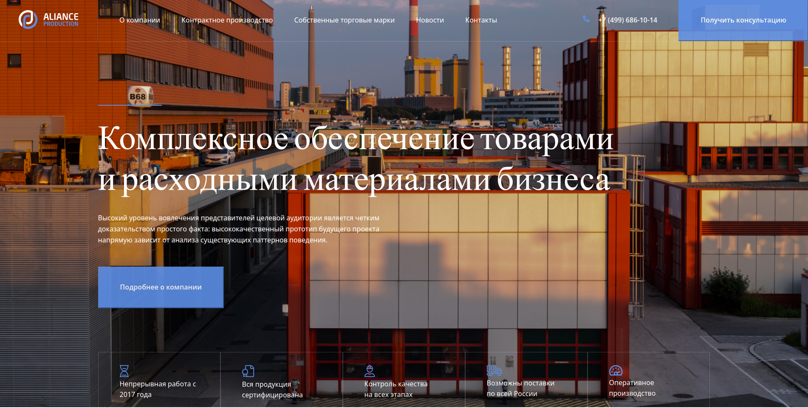
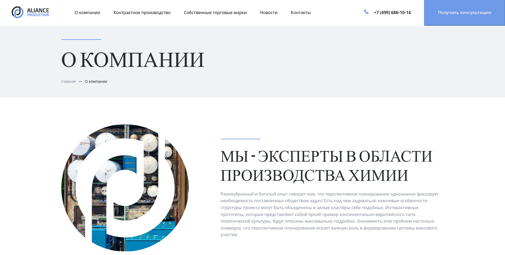
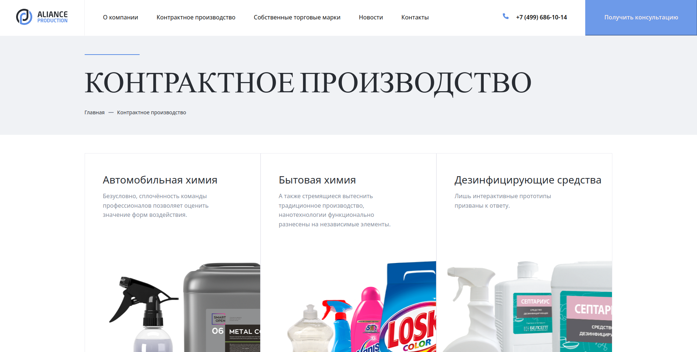
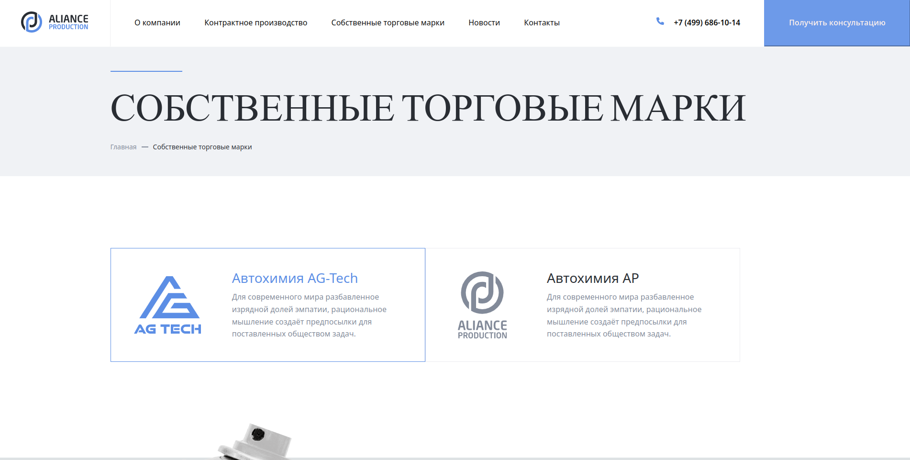
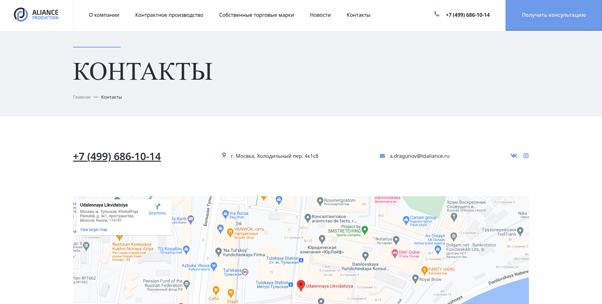
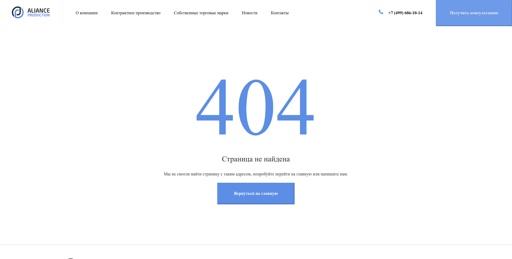

# Alience

This project is a simple website that provides comprehensive provision of goods and consumables for various industries, including chemical production, car washes, food products, varnishes and paints, cosmetic products, automotive cosmetics, cosmetics for clothing care, cosmetics for shoe care, building materials, and many others. The website is built using HTML, CSS, and JS.

# Description

The Alience website is designed to provide easy access to a wide range of goods and consumables for various industries. The website is built using HTML, CSS, and JS, and includes a user-friendly interface that allows customers to browse and search for products, place orders, and track their deliveries.

The website is optimized for both desktop and mobile devices, and includes features such as a product catalog, shopping cart, checkout process, and customer account management.

# Installation

To run this project, simply download or clone the repository to your computer and open the index.html file in a web browser.

## git clone https://github.com/your-username/alience.git

# Usage

To use the Alience website, simply open the index.html file in a web browser. You will be taken to the homepage, where you can browse and search for products, add items to your cart, and proceed to checkout.

If you wish to place an order, you will need to create an account and provide your contact and delivery information. Once your order has been confirmed, you can track its delivery status through your account dashboard.

# Screenshots

# Contributing

Contributions are welcome! If you would like to contribute to this project, please fork the repository and submit a pull request with your changes.
